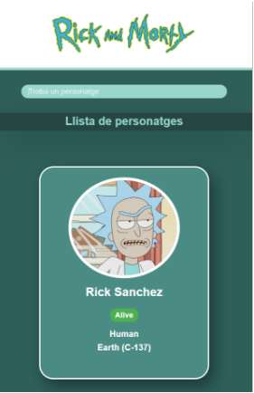

# rickmortyapi
RICKMORTY API

Instrucciones de ejecución del programa

1- Primero hay que descargar el ZIP que incluye el repositorio

2- Abrir el Visual Studio Code, y dentro se debe seleccionar la carpeta que incluye el ZIP.

3- Acceder a la Terminal donde se encuentra en la parte superior izquierda.

4- Escribir en la terminal lo siguiente: 

     npm install
     npm run dev

5-Luego aparece una dirección con un puerto, que hay que poner en el navegador para poderlo visualizar, aquí esta un ejemplo: 

6- Una vez dentro de la web ya se puede visualizar e interactuar con el buscador y el botón de cargar más.

PARTES INTERACTIVAS A DESTACAR

Versión web

Versión móvil

1- Lo primero interactivo a destacar es el logotipo, tiene un ligero movimiento de flotar todo el tiempo y se va iluminando a medida que asciende, luego al pasar por encima el ratón se ilumina.

2- El buscador muestra en tiempo real los personajes que se escriba.

 

3- Al pasar el ratón por encima de una carta se ilumina el borde y hace un ligero movimiento hacia arriba.

 

4- Al final de la pagina hay un botón que al pulsarlo se ilumina y se cargan mas personajes.

    

Tecnologías utilizadas y proceso del proyecto

- FIGMA: Utilice figma para crear un prototipo visual como modelo de guiá al crear los estilos de mi codigo.

- VISUAL STUDIO CODE: Preferentemente me gusta utilizar visual studio code como editor de codigo.

- REACT: Principalmente este proyecto he decidido hacerlo en React por que tengo buena habilidad y es mas cómodo para mi.

Detalles del contenido del código

App.jsx:

Estructura
    • Utilizo useState para manejar el estado de los personajes, la búsqueda y si hay más personajes para cargar.
    • Incluyo los componentes Logo1, LineaDelgada, ListaPersonajes y un botón para cargar más personajes.
Estilos
    • Aplico los estilos generales de la aplicación a través de App.css.
Propiedades
    • Defino las propiedades ancho, largo y margentop para el componente Logo1.

App.css:

Estructura del CSS
    • Aplico estilos globales que afectan a todos los elementos y al cuerpo de la aplicación.
    • Defino clases específicas para estilos como .logo, .tarjeta-personaje, .boton-mostrar-mas, entre otros.
    • Implemento animaciones para el logo y las tarjetas de personajes.
    • Utilizo media queries para mejorar la responsividad en dispositivos móviles.

LineaDelgada.jsx:

Estructura del Componente
    • Renderizo un div con la clase linea-delgada.

ListaPersonajes.jsx:

Estructura del Componente
    • Este componente muestra una lista de personajes utilizando el componente TarjetaPersonaje.
    • Verifico si hay personajes disponibles y los mapeo a TarjetaPersonaje.

Logo1.jsx:

Estructura del Componente
    • Utilizo propiedades para definir el tamaño y estilo del contenedor del logo.
    • Muestro la imagen del logo con el estilo aplicado.
Propiedades
    • largo: altura del contenedor.
    • margentop: margen superior del contenedor.

PersonajesAPI.jsx:

Estructura del Componente
    • Uso useEffect para cargar personajes al montar el componente y al cambiar la búsqueda.
    • Defino una función cargarPersonajes que se encarga de la lógica de obtención de datos.

TarjetaPersonaje.jsx:

Estructura del Componente
    • Renderizo una imagen, el nombre, el estado y el origen del personaje.
    • Aplico una clase CSS basada en el estado del personaje.
